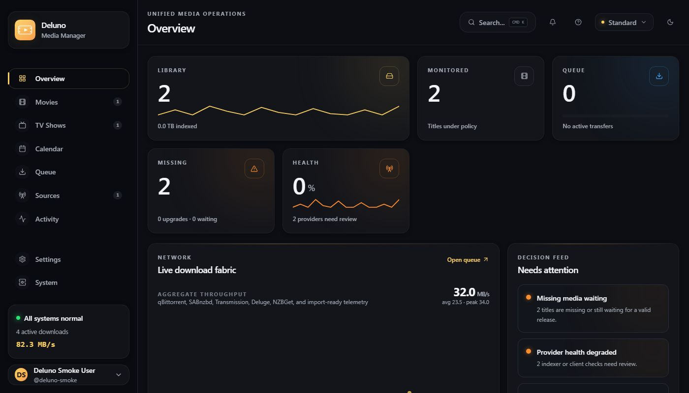
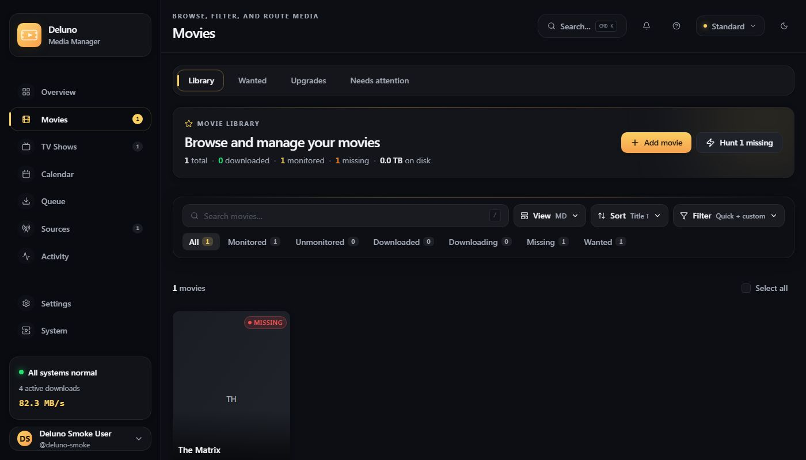
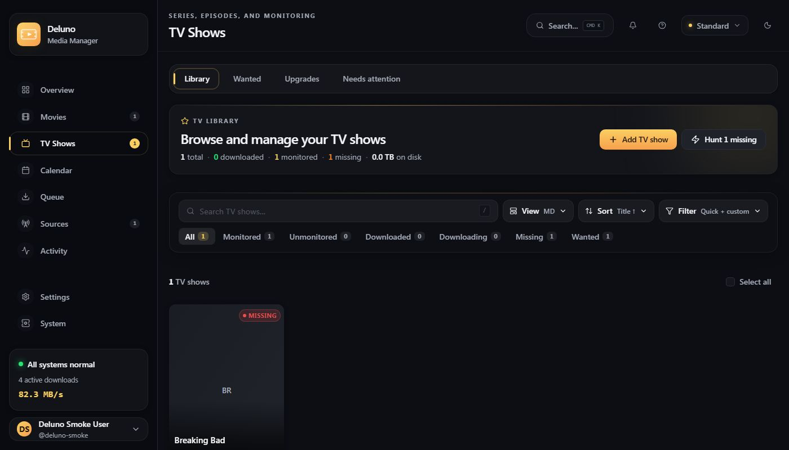
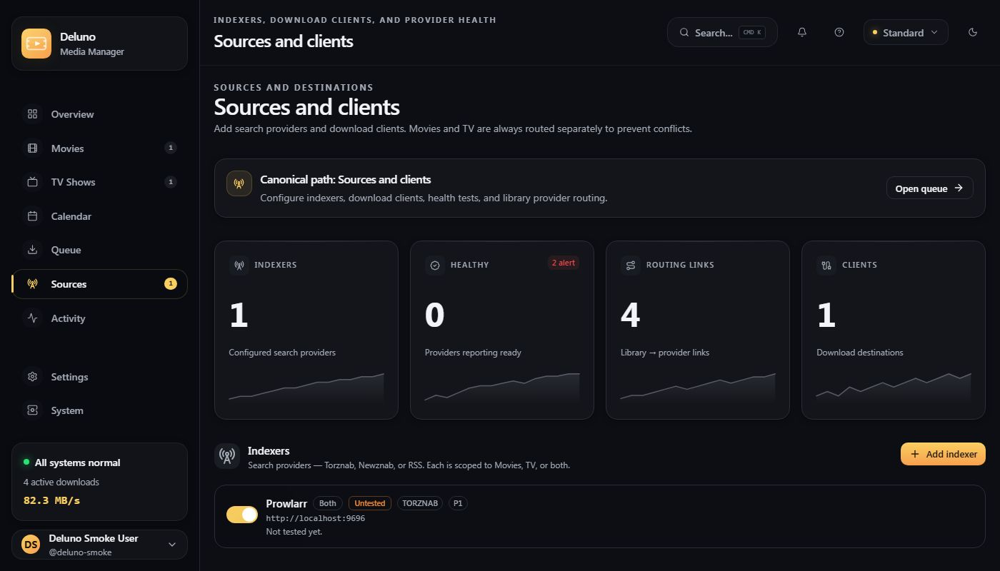
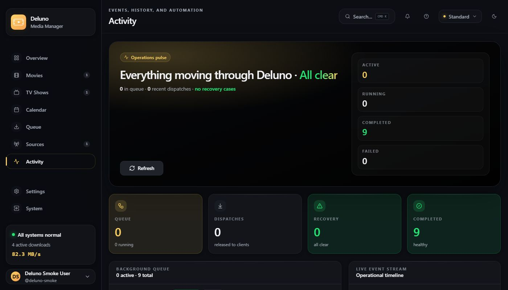
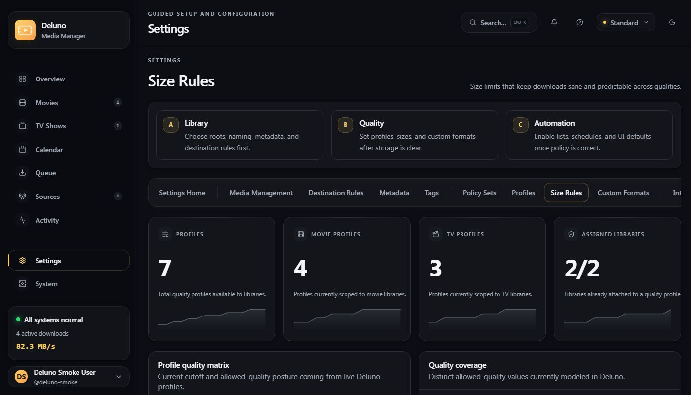
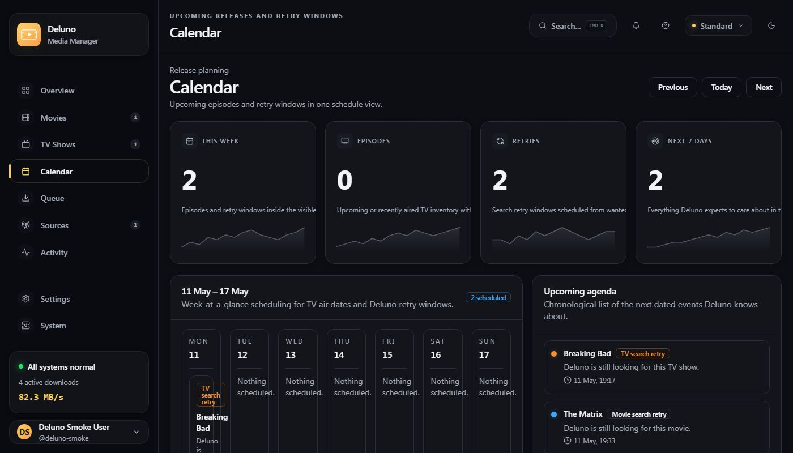

# Deluno

**A personal media manager built the way I needed it, not the way everyone else does it.**

---

## The honest story

I can't code. I mean it. I can barely write a `for` loop without looking it up. But I've been using media management software for years and always hit the same wall: they were built by coders, for coders, in ways that made sense to the people who wrote them. Not to me.

So I vibe coded this. Every line of it. I described what I wanted, AI helped build it, I broke it, we fixed it, repeat. Hundreds of iterations across weeks. I have enormous respect for the people who actually know what they're doing: the engineers who build tools like this properly, from first principles, with real expertise. I am not that. What I am is someone who needed something that worked **my** way, and now it does.

Deluno is the result. It's opinionated, it's mine, and if it happens to be useful to you too: great. If you're a developer looking at this codebase, yes, AI helped write it. No, I'm not embarrassed about that. The tool I needed exists now. That's what matters.

---

## Screenshots

### Overview - the full picture at a glance


### Movies - browse, filter, and manage your film library


### TV Shows - series and episode tracking


### Sources & Clients - indexers, download clients, and routing


### Activity - every job, every decision, logged


### Quality Profiles - set your standards and stick to them


### Calendar - what's coming and what's due


---

## What it does

Deluno manages the full pipeline from "I want this" to "it's in my library":

- **Completely separate movie and TV engines** - no shared logic, no conflicting folders, no bleedover
- **Quality profiles** - set a cutoff (for example, WEB 1080p) and Deluno only grabs what meets it
- **Replacement protection** - won't swap a 1080p file for a 720p one unless you say so
- **Custom format scoring** - filter and rank releases by name patterns, release groups, and tags
- **Library routing** - each library gets its own indexers and download client categories
- **Automatic search scheduling** - searches for missing and upgradeable items on a configurable timer
- **Live download telemetry** - real-time queue, speed, and status pulled from your download client
- **Full activity log** - every decision explained, every job recorded
- **Webhook notifications** - fire off a hook for any event you care about

---

## Getting started

### Requirements
- [.NET 10 SDK](https://dotnet.microsoft.com/download)
- [Node.js 20+](https://nodejs.org)

### Run locally

```bash
# Install frontend dependencies
npm install

# Start backend + frontend dev server together
npm run dev
```

Open **http://localhost:5173**. The first visit walks you through creating your account.

### Docker

```bash
docker compose up
```

---

## Tech stack

| Layer | Technology |
|---|---|
| Frontend | React 19 · React Router v7 · TypeScript · Vite |
| Backend | ASP.NET Core 10 · C# |
| Database | SQLite (WAL mode, one file per domain) |
| Realtime | SignalR WebSockets |
| Background workers | .NET hosted services |
| Auth | PBKDF2/SHA-256 · JWT |
| Tests | xUnit · Playwright |

Movies and TV are hard-separated at the module level. They share no business logic. If you want to understand the structure, start with [`AGENTS.md`](AGENTS.md) and [`docs/ARCHITECTURE.md`](docs/ARCHITECTURE.md).

---

## Development and operations docs

### Local dev helpers

- `npm run dev:local` starts or reuses the backend on `http://127.0.0.1:5099` and the Vite frontend on `http://127.0.0.1:5173`
- it writes status to `.deluno/boot-health.json` and logs under `.deluno/logs/`
- for frontend-only work, run the backend first and then use `npm run dev --workspace apps/web`

### Repository maps

- [docs/README.md](docs/README.md)
- [docs/ARCHITECTURE.md](docs/ARCHITECTURE.md)
- [docs/repo-change-history.md](docs/repo-change-history.md)
- [docs/QUALITY_SCORE.md](docs/QUALITY_SCORE.md)
- [docs/exec-plans/tech-debt-tracker.md](docs/exec-plans/tech-debt-tracker.md)

### Runtime guides

- [docs/packaging.md](docs/packaging.md)
- [docs/DEPLOYMENT.md](docs/DEPLOYMENT.md)
- [docs/TROUBLESHOOTING.md](docs/TROUBLESHOOTING.md)

---

## Repo layout

```text
apps/web/          React frontend
src/
  Deluno.Host/     ASP.NET Core host and composition root
  Deluno.Platform/ Settings, libraries, quality, auth
  Deluno.Movies/   Movie catalog, wanted state, search, import
  Deluno.Series/   TV catalog, episodes, wanted state, search
  Deluno.Jobs/     Background job scheduling and execution
  Deluno.Integrations/ Indexer and download client abstractions
  Deluno.Realtime/ SignalR hub wiring
  Deluno.Filesystem/ Import pipeline and file policies
  Deluno.Infrastructure/ Storage, migrations, runtime
tests/             xUnit persistence and unit tests
docs/              Architecture, strategy, and product docs
```

---

## Contributing

PRs are welcome. The `main` branch is protected. CI (backend tests plus the Playwright smoke suite) must pass before anything merges.

For small fixes, just open a PR. For bigger changes, open an issue first so we can agree on direction before you spend time on it.

---

## A note on how this was built

Every line of code in this repo was written with AI based on my descriptions, feedback, and direction. I provided the product vision, the UX requirements, the bug reports, and the "this doesn't feel right" moments. The implementation was generated from that direction.

I have deep respect for software engineers. Building something like this from scratch, from memory, is a skill I don't have and probably never will. But the tooling has reached a point where someone like me, opinionated, persistent, and clear about what I want, can direct the creation of something genuinely useful. That's remarkable, and I don't take it for granted.

To the developers whose open-source media tools inspired this: thank you. The ideas came from watching you do it right.
