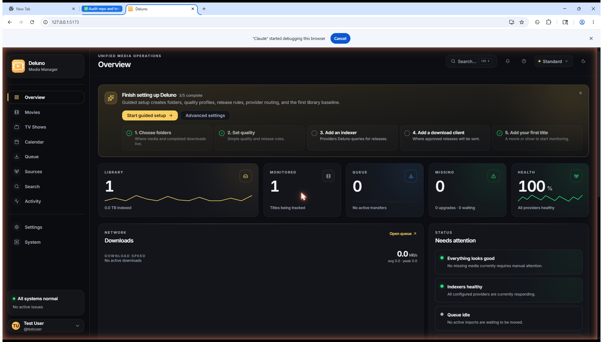
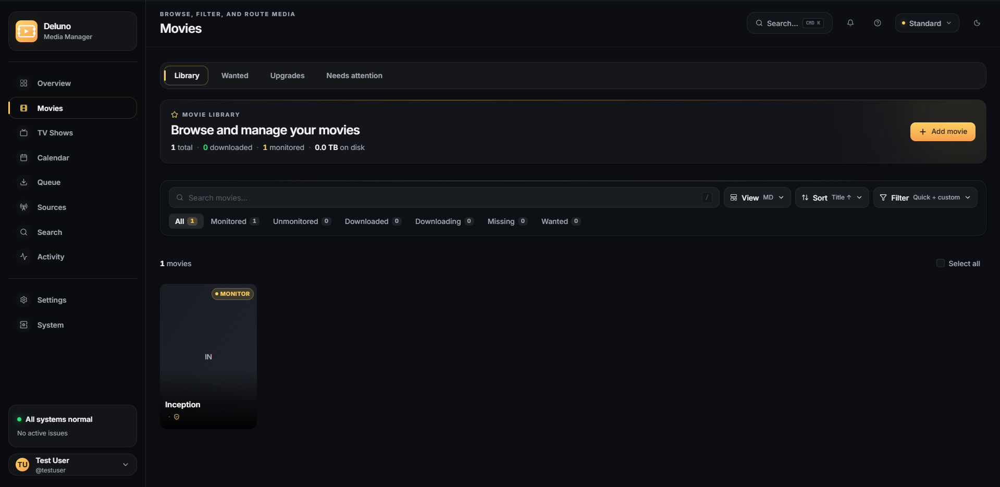
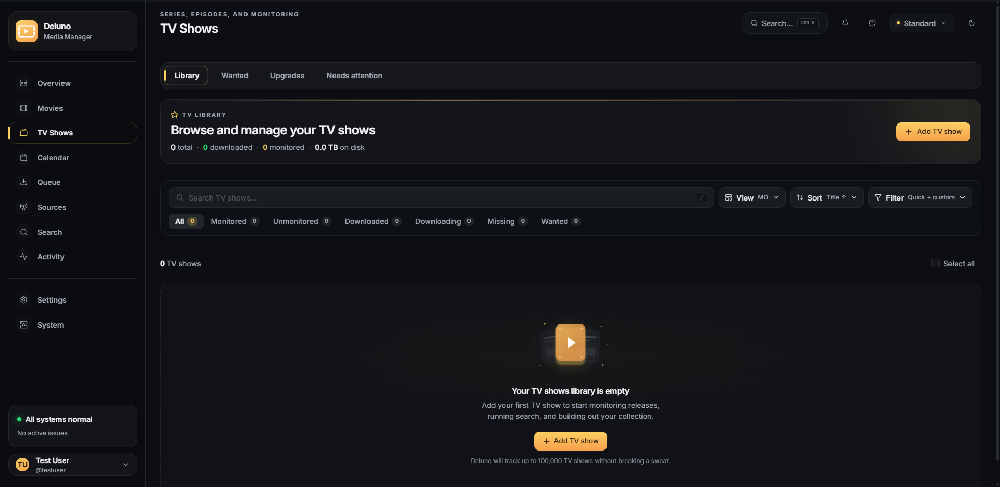
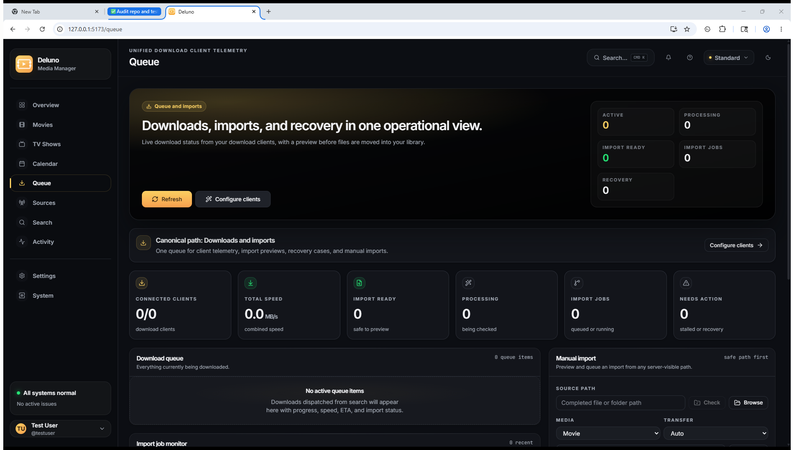
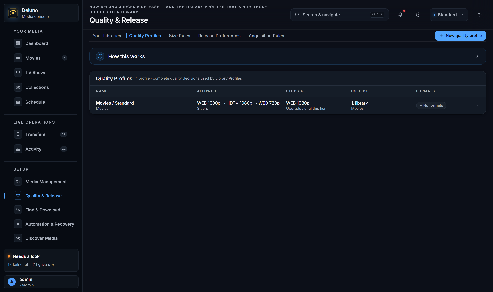
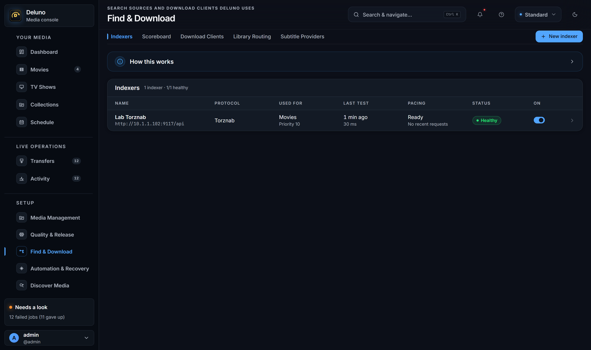
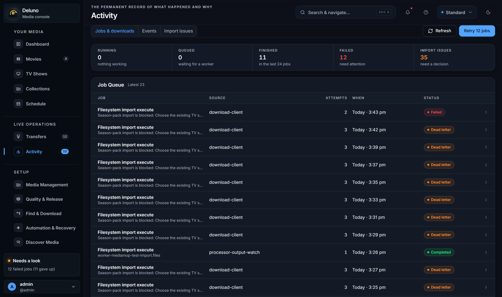

# Deluno

Vibe coded personal media manager for movies and TV. Built it for myself because I wanted something that works the way I think about my library — separate engines for movies and shows, real quality logic, and full visibility into what's actually happening.

Not trying to be Radarr/Sonarr. Just a thing that works for me, shipped because someone else might want it too.

---

 

*Overview dashboard · Movies library*

 

*TV shows · Download queue*

 

*Quality profiles · Sources and clients*



*Activity log — every import, rename, and job recorded*

---

## What it does

- Separate movie and TV engines — they never fight over the same downloads
- Quality profiles with cutoff logic and custom format scoring
- Library-routed indexers and download clients — each library can point at different providers
- Automated missing and upgrade search cycles
- Live download telemetry on the dashboard
- Full operational audit trail in Activity
- Guided first-run setup to get from zero to downloading in minutes

## Quick start

### Windows

Download the installer from [Releases](https://github.com/jampat000/Deluno/releases). Velopack handles installation and in-app updates.

| | |
|--|--|
| Install | `%LocalAppData%\Deluno` |
| Data | `%LocalAppData%\DelunoData` |
| Config | `%LocalAppData%\Deluno\config\deluno.json` |

Updates appear in **System → Updates** and install in the background.

### Docker

```yaml
services:
  deluno:
    image: ghcr.io/jampat000/deluno:latest
    ports:
      - "8080:8080"
    volumes:
      - ./data:/data
      - /your/media:/media
      - /your/downloads:/downloads
    restart: unless-stopped
```

```bash
docker compose up -d
```

Open [http://localhost:8080](http://localhost:8080).

To update: pull the new image and recreate the container. No in-place updater runs inside containers.

### Local dev

Requires [.NET 10 SDK](https://dotnet.microsoft.com/download) and [Node.js 20+](https://nodejs.org).

```bash
npm install
npm run dev:web        # Vite frontend → :5173
```

In a second terminal:

```bash
.dotnet/dotnet.exe run --project src/Deluno.Host   # API → :5099
```

## Notes

- Data is stored in SQLite — separate databases per domain (movies, series, jobs, cache)
- No agent needed; the backend serves the frontend and runs all background work
- ffmpeg is required for stream probing — bundled in the Docker image, must be on PATH for Windows
- SignalR live updates use `?access_token=` for WebSocket auth (standard browser behaviour)

## Docs

- [Architecture](./docs/ARCHITECTURE.md)
- [Deployment](./docs/DEPLOYMENT.md)
- [Packaging and releases](./docs/packaging.md)
- [Troubleshooting](./docs/TROUBLESHOOTING.md)

## License

MIT
